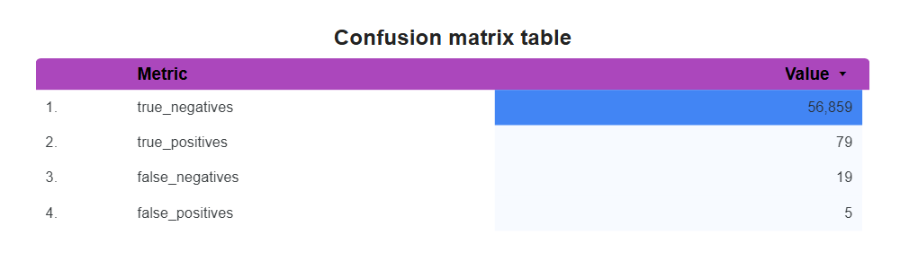

# Fraud Finder – Credit Card Fraud Detection Pipeline

Welcome to the official repository for **Fraud Finder**, our CSI-4150/5150 AI for IT Operations project. This end-to-end machine learning pipeline detects credit card fraud using Google Cloud's Vertex AI platform.

## 📁 Project Structure

- `.pipeline/` – Key steps in `.pipeline/cloudbuild.yaml`:
  - Compiles the `vetexai_pipeline.py` file into a pipeline JSON
  - Executes the pipeline on Vertex AI using a custom Docker image
  - Pulls data directly from a GCS bucket
  - Tracks logs through Cloud Logging
- `dashboard/` – Looker Studio exports and visualizations
- `data/` – Where your Kaggle dataset will be
- `docker/` – Custom Docker image and container setup
- `serving_model_code/` – Batch + immediate prediction model interface
- `tests/` – Evaluation and unit tests
- `vetexai_pipeline.py` – Main pipeline script that defines and runs the full ML flow
- `XAI.ipynb` – Explainability notebook using SHAP

## 🚀 Pipeline Overview

This repo contains an end-to-end pipeline that includes:

- **Data Preprocessing** – Scaling, outlier handling, and feature engineering (e.g., extracting hour from time)
- **Data Splitting** – Train, validation, and test splits with stratification
- **Model Training** – XGBoost classifier tuned for imbalanced data
- **Evaluation** – Confusion matrix, classification report, ROC AUC, and detailed visual summaries
- **Batch Prediction** – Optional batch inference on test data using deployed model on Vertex AI
- **Explainability** – SHAP-based XAI insights into model decision-making

## 🧠 Key Technologies

- **Vertex AI Pipelines** – Automates data flow and training steps
- **XGBoost** – High-performing model for tabular fraud detection
- **Docker + GCR** – Custom environments for portability
- **Google Cloud Storage** – Handles datasets and model artifacts
- **Looker Studio** – Dashboard for metric visualization
- **Pub/Sub Simulation** – Real-time prediction setup simulated from batch data

## 🧪 How to Run

## 🧪 How to Run

This pipeline is designed to run automatically using **Google Cloud Build**.

To trigger it, use:

```bash
gcloud builds submit --config=.pipeline/cloudbuild.yaml .
```

*Make sure to update your `PROJECT_ID`, `BUCKET_NAME`, and `REGION` in the vetexai_pipeline.py script if needed.*

## 📊 Confusion Matrix (Evaluation Results)

Our trained model's performance on the test set:

| Metric           | Value   |
|------------------|---------|
| True Negatives   | 56,859  |
| True Positives   | 79      |
| False Negatives  | 19      |
| False Positives  | 5       |



## 👥 Authors

- Austin Wright  
- Absalat Getachew  
- Alekya Mothuri  
- Raihan Khan

---

Feel free to open an issue or reach out if you need help accessing or understanding any part of the project.
